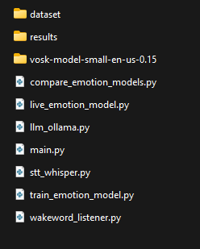

# Emocionālās runas analīze virtuālajam asistentam

Šis projekts ir bakalaura darba praktiskā daļa par emocionālās runas atpazīšanu (Speech Emotion Recognition) un tās pielietošanu virtuālo asistentu uzlabošanā.

Sistēma spēj:
- analizēt lietotāja balsi;
- noteikt emociju no runas;
- pārvērst runu tekstā;
- pielāgot virtuālā asistenta atbildes atbilstoši emocijai.

Projektā tiek izmantoti:
- Python
- Vosk
- Whisper
- Ollama
- SVM modelis emociju klasifikācijai

---

# Projekta struktūra

project/

---

# Nepieciešamās bibliotēkas

Instalēt nepieciešamās Python bibliotēkas:

pip install -r requirements.txt

Ja requirements.txt nav pieejams, nepieciešams instalēt bibliotēkas manuāli.

---

# Ollama instalācija

Lai virtuālais asistents darbotos, nepieciešams instalēt Ollama:

https://ollama.com/download

Pēc instalācijas nepieciešams lejupielādēt modeli:

ollama pull llama3.1:8b

---

# Datu kopas lejupielāde

Tā kā izmantotā datu kopa ir pārāk liela GitHub glabāšanai, tā netiek iekļauta repozitorijā.

Lai palaistu projektu, nepieciešams:

1. Lejupielādēt datu kopas arhīvu no Google Drive:

[GOOGLE_DRIVE_LINK](https://drive.google.com/file/d/10YsnVHBD-tUqDPq8W4bxIM41lWrDIbRI/view?usp=sharing)

2. Izpakot arhīvu.

3. Ievietot datu kopas mapi projekta direktorijā.

---
# Vosk modeļa lejupielāde

Tā kā mape `vosk-model-small-en-us-0.15` ir pārāk liela GitHub glabāšanai, tā netiek iekļauta repozitorijā.

Nepieciešams:

1. Lejupielādēt arhīvu no saites:

[GOOGLE_DRIVE_LINK](https://drive.google.com/file/d/13hUYKJz7Th7G7mvNLcPZzN5uXvewMfy0/view?usp=sharing)

2. Izpakot arhīvu.

3. Mapi ar nosaukumu:

vosk-model-small-en-us-0.15

ievietot tajā pašā direktorijā, kur atrodas projekta faili (`main.py`, `live_emotion_model.py` utt.).

---

# Modeļa apmācība

Lai apmācītu emociju atpazīšanas modeli:

python train_emotion_model.py

Pēc apmācības modeļa faili tiks saglabāti mapē:

results/

---

# Virtuālā asistenta palaišana

Lai palaistu virtuālo asistentu:

python main.py

---

# Balss komandas

Sistēma izmanto šādas komandas:

- bob - aktivizēt asistentu
- reset - notīrīt sarunas atmiņu
- exit - aizvērt programmu

---

# Piezīmes

- Mikrofonam jābūt pieejamam sistēmā.
- Ollama servisam jābūt instalētam un palaistam.
- Projekts tika testēts uz Windows operētājsistēmas.
